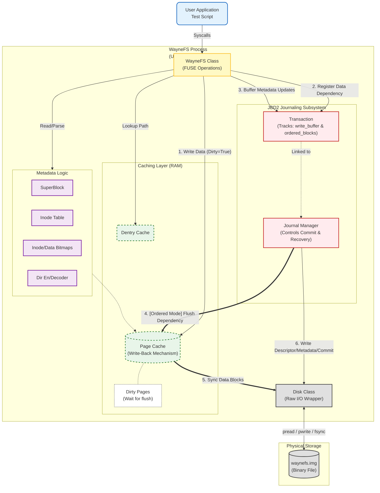
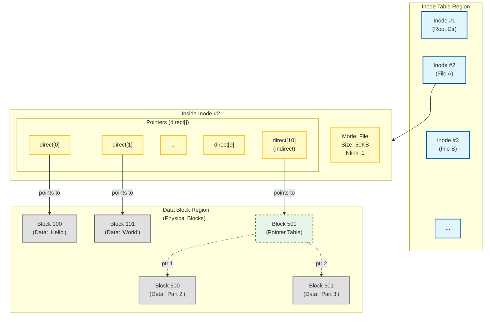

# Wayne File System

## Project Overview

**WayneFS** is a user-space file system implemented from scratch in Python and mounted using FUSE (Filesystem in Userspace).

The primary goal of this project is to simulate and understand the low-level internal mechanisms of a file system. Unlike a simple file wrapper, WayneFS manages a raw binary file acting as a physical disk, manually handling block allocation, metadata management, and crash consistency.

It features advanced storage concepts such as **JBD2-style Journaling**, **Write-Back Caching**, and **Indirect Block Addressing**, making it a robust educational tool for understanding Linux storage stacks.

## Architecture

### System Architecture
The following diagram illustrates the high-level data flow, from the user application down to the physical disk simulation.

### Inode Relationship Map
This diagram depicts how Inodes map to physical data blocks, including the logic for direct and indirect pointers.

## Development Roadmap

The project is divided into four distinct phases, evolving from a simple synchronous file system to a complex, crash-consistent storage engine.

### ✅ Phase 1: Core Architecture & Basic CRUD
*Goal: Establish the fundamental on-disk layout and enable basic file operations.*

1.  **SuperBlock:** Defined disk partition information and filesystem geometry.
2.  **Inode Table:** Implemented the metadata storage structure mapping inodes to Logical Block Addresses (LBA).
3.  **Bitmaps:** Implemented allocation management for Inodes and Data Blocks.
4.  **Directory Operations:** Implemented `getattr`, `readdir`, `mkdir`, and `rmdir`.
5.  **File Operations:** Implemented `create`, `open`, `write`, and `read`.
6.  **Attributes:** Implemented `truncate`, `rename`, and `utimens` (timestamps).
7.  **Permissions & Links:** Implemented hard `link` and `chmod`.

### ✅ Phase 2: Advanced Features & Journaling
*Goal: Enhance system capabilities with caching, large file support, and basic journaling.*

1.  **Ordered Journaling:** Implemented a Write-Ahead Logging (WAL) mechanism to ensure metadata consistency.
2.  **Caching Layer:** Introduced **Page Cache** for file data and **D-entry Cache** for path lookups to improve read performance.
3.  **Indirect Blocks:** Extended file size limits beyond the initial 12 direct pointers:
    - Implemented **Singly Indirect Blocks** (`direct[10]`).
    - Implemented **Doubly Indirect Blocks** (`direct[11]`).
    - Theoretical max file size expanded to approx. 4GB `(10 + 1024 + 1024*1024) * 4KB`.
4.  **Symbolic Links:** Implemented `symlink` and `readlink`.
5.  **Filesystem Statistics:** Implemented `statfs` for disk usage reporting (`df` command).

### ✅ Phase 3: Performance Optimization & JBD2 Integration
*Goal: Bridge the gap between simulation and real-world OS behavior by optimizing I/O patterns and ensuring crash consistency.*

1.  **Write-Back Caching:**
    - Transitioned from a slow **Write-Through** mechanism (immediate disk writes) to a **Write-Back** strategy.
    - Implemented "Dirty Page" tracking, where data persists in RAM until an explicit `fsync` or journal commit occurs.
2.  **JBD2 "Ordered Mode" Logic:**
    - Refined the journaling mechanism to strictly follow Linux JBD2's **Ordered Mode**.
    - **Dependency Tracking:** The system now tracks which data blocks correspond to a transaction.
    - **Ordering Enforcement:** Ensures that *dirty data blocks are flushed to disk* **before** the associated metadata transaction is committed to the journal, preventing stale data on crash recovery.

### Phase 4: Future Work
1.  **Copy-on-Write (CoW):** Design and implement a CoW mechanism to support snapshots and non-destructive writes.

