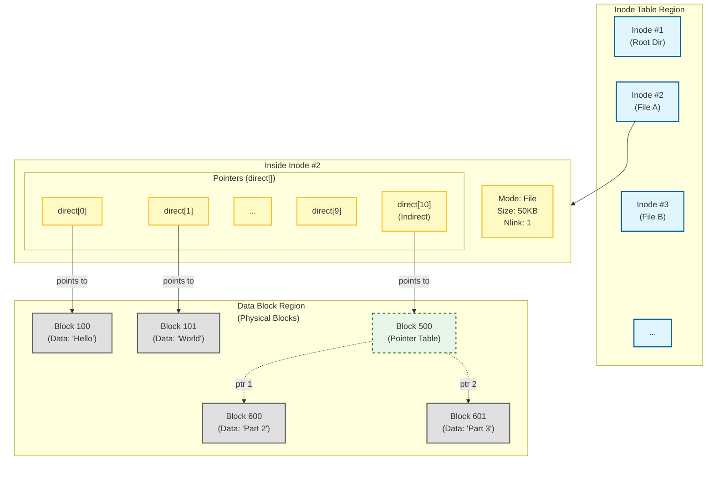

# Wayne File System

## 目標

在這個專案中，使用 python 實作 file system 並且利用 macFUSE 掛載，以達到完整檔案系統的功能

### 架構圖

```mermaid
graph TD
    %% --- Style Definitions ---
    classDef user fill:#e3f2fd,stroke:#1565c0,stroke-width:2px,rx:10,ry:10;
    classDef vfs fill:#fff9c4,stroke:#fbc02d,stroke-width:2px;
    classDef cache fill:#e8f5e9,stroke:#2e7d32,stroke-width:2px,stroke-dasharray: 5 5;
    classDef meta fill:#f3e5f5,stroke:#7b1fa2,stroke-width:2px;
    classDef jbd fill:#ffebee,stroke:#c62828,stroke-width:2px;
    classDef disk fill:#e0e0e0,stroke:#424242,stroke-width:2px;
    classDef note fill:#ffffff,stroke:#333333,stroke-dasharray: 2 2;

    %% --- 1. User Space ---
    User[User Application <br/> Test Script]:::user
    
    %% --- 2. WayneFS Logic Container ---
    subgraph WayneFS ["WayneFS Process<br/>(User Space)"]
        direction TB
        
        %% Entry Point
        FUSE_Interface["WayneFS Class<br/>(FUSE Operations)"]:::vfs
        
        %% --- Memory Layer ---
        subgraph Memory_Layer ["Caching Layer (RAM)"]
            direction LR
            DC(Dentry Cache):::cache
            PC[("Page Cache<br/>(Write-Back Mechanism)")]:::cache
            Dirty_State["Dirty Pages<br/>(Wait for flush)"]:::note
            PC -.- Dirty_State
        end

        %% --- Metadata Logic Layer ---
        subgraph Metadata_Layer ["Metadata Logic"]
            direction LR
            SB[SuperBlock]:::meta
            IT[Inode Table]:::meta
            BM[Inode/Data Bitmaps]:::meta
            DirOps[Dir En/Decoder]:::meta
        end

        %% --- Consistency Layer ---
        subgraph JBD2_Layer ["JBD2 Journaling Subsystem"]
            direction TB
            TX["Transaction<br/>(Tracks: write_buffer & ordered_blocks)"]:::jbd
            Journal["Journal Manager<br/>(Controls Commit & Recovery)"]:::jbd
        end

        %% --- Driver Layer ---
        DiskDriver["Disk Class<br/>(Raw I/O Wrapper)"]:::disk
    end

    %% --- 3. Physical Storage ---
    subgraph Storage ["Physical Storage"]
        Img[("waynefs.img<br/>(Binary File)")]:::disk
    end

    %% ==========================================
    %% Connections & Logic Flow
    %% ==========================================

    %% 1. User Interaction
    User -->|Syscalls| FUSE_Interface

    %% 2. Cache Interaction (Read/Write Path)
    FUSE_Interface -->|Lookup Path| DC
    FUSE_Interface -- "1. Write Data (Dirty=True)" --> PC
    
    %% 3. Metadata Parsing
    FUSE_Interface -- Read/Parse --> Metadata_Layer
    Metadata_Layer -.-> PC

    %% 4. Transaction Setup
    FUSE_Interface -- "2. Register Data Dependency" --> TX
    FUSE_Interface -- "3. Buffer Metadata Updates" --> TX
    
    %% 5. JBD2 Commit Process (The Critical Path)
    TX -.->|Linked to| Journal
    
    %% Ordered Mode Enforcement (Red Lines)
    Journal == "4. [Ordered Mode] Flush Dependency" ==> PC
    PC == "5. Sync Data Blocks" ==> DiskDriver
    
    %% Journal Logging
    Journal -- "6. Write Descriptor/Metadata/Commit" --> DiskDriver

    %% Driver Output
    DiskDriver <-->|pread / pwrite / fsync| Img

    %% Layout Adjustments
    DC ~~~ PC
```

### Inode 關聯圖

分為以下幾階段實作

### ✅ 第一階段 (基本 CRUD 功能)
1. 建立 SuperBlock，裡面含有 patition 資訊
2. 建立 Inode Table，紀錄當前資料的資訊以及實體 offset，就是 LBA
3. 建立 Bitmap，紀錄哪些實體位置可以使用
4. 實作 getattr, readdir, mkdir, rmdir 功能，並且驗證
5. 實作 create, open, write, read 功能，並且驗證
6. 實作 truncate, rename, utimens 功能，並且驗證
7. 實作 link, chmod 功能，並且驗證

### ✅ 第二階段 (Journal 功能，擴充大小)
1. 實作 Ordered Journal 功能，並且驗證
2. 實作 Page Cache, D-entry Cache 功能，並且驗證
3. 實作 Indirect Blocks，使檔案大小可以突破原本 direct 指標只有 12 組的限制，並且驗證
    - 定義 direct[10] 為單層間接指標
    - 定義 direct[11] 為雙層間接指標
    - 最大檔案寫入可擴充至 (10 + 1024 + 1024 * 1024) * chunk_size = 40KB + 4MB + 4GB ~= 4GB
4. 實作 symlink, readlink 功能，並且驗證
5. 實作 statfs 功能，並且驗證

### ✅ 第三階段 (Cache 功能優化以及 JBD2 導入)
1. 修改 Cache 機制，從 Write-Through 機制 (每次寫入 page cache 後立刻寫入硬碟) 改成 Write-Back (標記 page cache dirty 等 VFS 下 fsync 才寫入硬碟)
2. 修改 Journal 機制以達到 JBD2 Ordered 的邏輯，以避免每次 commit journal 時會寫入非 touch 的 data block

### 第四階段 (CoW 機制)
1. 設計 Copy-on-Write 機制

